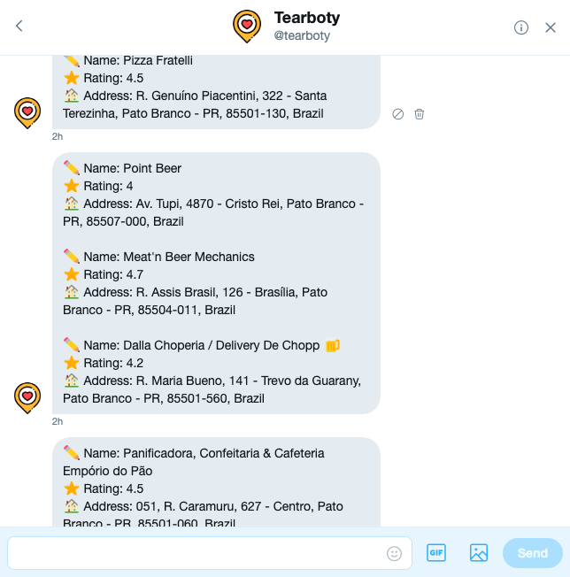

# TearBoty Bot
Twitter bot for searching locations using emojis.

<p align="center">
  
</p>

# Features
* @tearboty 🍞 - Search nearby bakeries
* @tearboty `Location` 🍞 - Search bakeries on Location

# Prerequisites
* [Node.js](https://nodejs.org/en/)

# Running
### 1. Configure
````
# Bot
Create and configure .env file like .env.example.
````

### 2. Twitter
````
# Create an Twitter application
Create an application on https://developer.twitter.com/en/apps.

# Get keys and tokens
Access application details and click on 'Keys and tokens' button.

# Configure
Get your credentials and set in .env.
````

### 3. Foursquare Places
````
# Foursqare console
Go to Foursquare on https://foursquare.com/developers/apps.

# Select a app
Select app or click on 'Create A New App'.

# Get credentials
On app details, copy client id, client secret and set in .env.
````

### 4. Run
````
# Install dependencies
npm install

# Start
npm start
````

# Built With
* [Node.js](https://nodejs.org/en/)

# Authors
* [xxgicoxx](https://github.com/xxgicoxx/)

# Acknowledgments
* [FlatIcon](https://www.flaticon.com/)